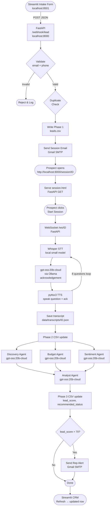

# ASE Pipeline Architecture

## System Flow



## Component Map

| Component | Port | Description |
|---|---|---|
| Streamlit | 8501 | Intake form + CRM dashboard |
| FastAPI | 8000 | Webhook, session page, WebSocket |
| Ollama | 11434 | Local LLM server |
| Whisper | — | Local STT, model=small |
| pyttsx3 | — | Local TTS engine |
| Gmail SMTP | 465 | Session + rep emails |

## Data Flow

```
Intake → Phase 1 CSV → Voice Session → Phase 2 CSV → 4 Agents → Phase 3 CSV
```

## Models Used

| Task | Model | Where |
|---|---|---|
| Voice session (STT) | Whisper small | Local |
| Real-time acknowledgement | gpt-oss:20b-cloud | Ollama → cloud |
| Discovery, Budget, Sentiment, Analyst | gpt-oss:20b-cloud | Ollama → cloud |
